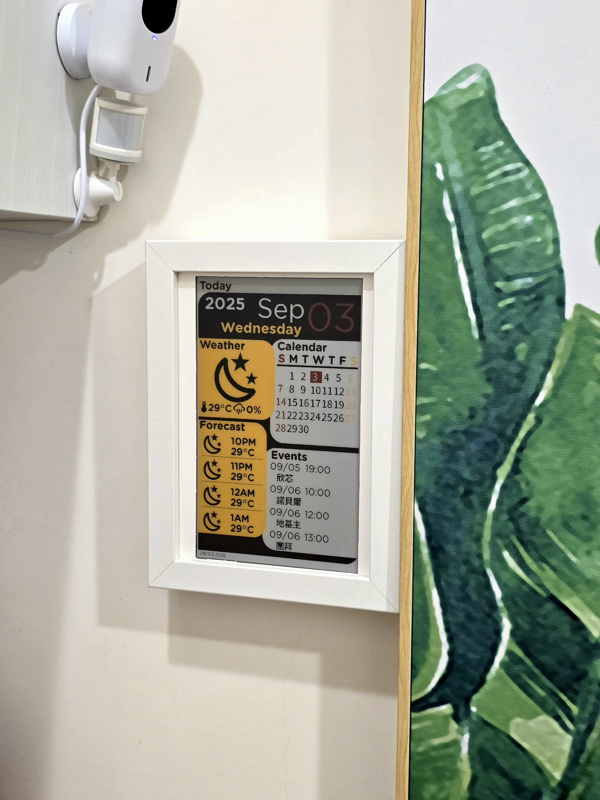
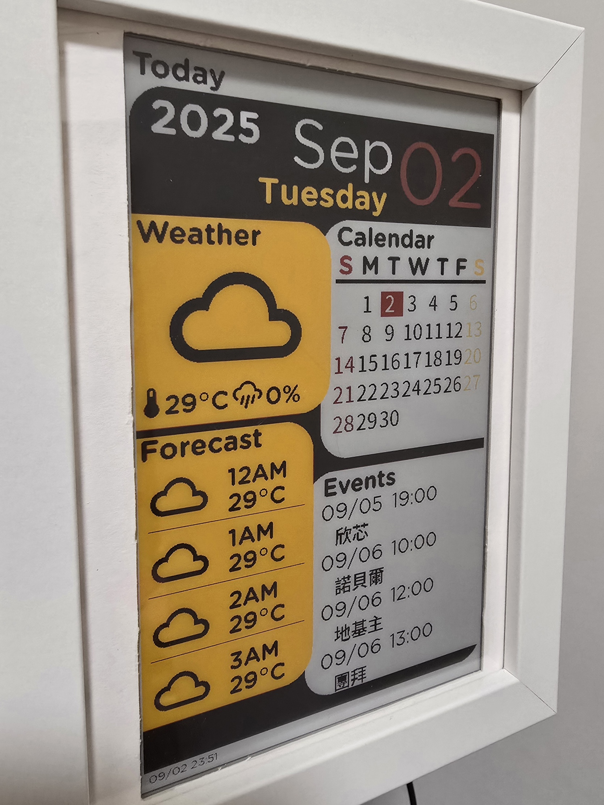
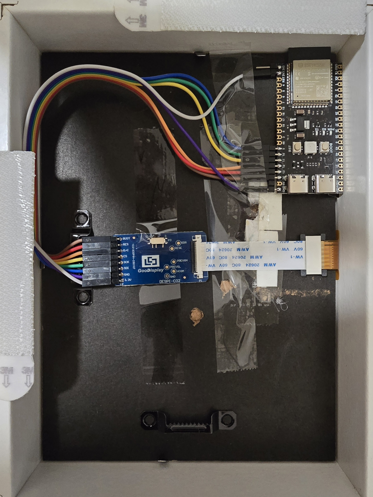

# ESPHome E-ink 4 colors dashboard

感謝[tsunglung](https://github.com/tsunglung/esphome_epaper)開發此專案用的四色電子紙ESPhome component

本專案利用 7.5 吋四色電子紙搭配 ESPHome 與 Home Assistant，在指定的時段內固定會自動更新，以顯示天氣預報與行事曆。



四色資訊板顯示內容包括:
- 今天日期
- 當下天氣預報
- 未來四小時天氣預報
- 當月月曆
- 未來一週內最近四筆行事曆(會顯示時間日期與標題)



以下將說明硬體架構、ESPHome yaml code與Home assistant yaml code

## Hardware 硬體架構



- [7.5吋四色eink電子紙](https://item.taobao.com/item.htm?id=809151983431) - GDEM075F52 （24Pin）
- [FPC-24pins轉2.54mm-8pins](https://item.taobao.com/item.htm?id=809151983431) - C02 轉接板
- [ESP32-S3核心板 開發板](https://item.taobao.com/item.htm?id=724415068331&skuId=5030810340877) - ESP32-S3N16R8，銲接排針（向下），無資料線，CH343P
- [杜邦線](https://detail.tmall.com/item.htm?&id=14466195609&skuId=5922240227983) - 杜邦線21CM 母對母 2.54mm（1排40P） **可選短一點的10CM**
- [IKEA RÖDALM 相框 13x18公分](https://www.ikea.com.tw/zh/products/wall-decoration/frames/rodalm-art-50550033) - 外框有木黑白三色，**注意裱框紙開孔較小，需要挖大**

### 硬體安裝:

1. 取一排8條杜邦線，不需要撕成一條一條，撕成一整排比較好接
2. 用杜邦線根據下表接法連接ESP32S3開發板與C02轉接板
   
| ESP32S3 | C02轉接板 |
|:-------:|:-----:|
| GPIO14 | BUSY |
| GPIO13 | RES |
| GPIO12 | D/C |
| GPIO11 | CS |
| GPIO10 | SCK |
| GPIO9 | SDI |
| GND | GND |
| 3V3 | 3.3V |

3. 接好後再將C02轉接板接上電子紙的FPC排線
4. 供電與燒錄都是從開發板上的`USB`

## 軟體安裝

1. 將`/fonts`資料夾內的檔案及`eink-4c-dashboard.yaml`放到homeassistant/esphome的資料夾內
2. 將`eink_dashboard_sensor.yaml`放到homeassistant/packages內
3. 將`eink_dashboard_sensor.yaml`的內容修改成自己HA裡的實體ID，>> [詳細說明](#ha-template-sensor-說明)
4. 將`/images`內的`bg_4c.png`放到homeassistant/esphome/images的資料夾內
5. HA檢查YAML code有無錯誤
    1. 開發工具>YAML>檢查設定內容，確認左下角通知沒有出現錯誤
    2. YAML 設定新載入中>模板實體
    3. 開發工具>狀態>檢查`sensor.eink_sensors`及`sensor.upcoming_calendar_events`有確實出現，以及內容是正確的
6. 在ESPhome將`eink_dashboard_sensor.yaml`編譯後燒錄至ESP32S3模組
7. 等待可在HA內看到模組上線後，手動按"Screen Refresh"確認螢幕可正常顯示內容

## 面板更新時機

因為此型號電子紙不支援局部刷新，故不需要一直刷新，程式預設不會自動更新`update_interval: never`

是直接在ESPhome內做自動化，每小時更新一次，同時當來自HA的每日定時感測器為`True`時，才會刷新一次

**請先在HA內建立"每日定時感測器"輔助工具:**

在HA設定>裝置與服務>輔助工具>新增輔助工具>"每日定時感測器">設定想要更新的時段，名稱填`eink_refresh_time`

### ESPhome yaml解說:

由於行事曆是在每小時5分更新，天氣預報則是每小時10分更新，所以ESPhome自動化設定成每小時15分更新一次

```YAML
time:
  - platform: homeassistant
    id: ha_time
    on_time: 
      seconds: 0
      minutes: 15
      hours: "/1"
      then: 
        - if:
            condition:
              - binary_sensor.is_on: eink_refresh_time
            then:      
              - component.update: 'my_display' 
```

## HA template sensor 說明 

**要先確認在已經將以下程式碼寫在`configuration.yaml`內，這樣`eink_dashboard_sensor.yaml`檔案放進去才會生效**


此template sensor是將想要的資料格式化後再丟給資訊面板顯示，內容包含兩部分一個是天氣預報，一個是取得最近7日內四筆行事曆的標題

### 天氣預報:

由於預設是顯示取得每小時的預報，**請先確認目前用的天氣整合有支援小時預報 (內建的met.no有)**

以下YAML表示每小時的10分將會呼叫取得"每小時"的天氣預報服務，同時更新內容在sensor.eink_sensors裡面

```YAML
  - trigger:
      # 每小時的10分更新一次
      - platform: time_pattern     
        hours: "/1" 
        minutes: 10 
    action:
      - action: weather.get_forecasts
        target:
          entity_id: weather.myhome #REPLACE with your weather entity id   
        data:
          type: hourly
        response_variable: hourly     
      - variables:
          hourly_forecasts: "{{ hourly['weather.YOUR_WEATHER_ID'].forecast }}"
```

要注意更新面板的時機要在更新天氣預報之後，不然都會看到前一個小時的預報

會使用天氣預報回傳結果的第1組當作這小時的預報，並顯示第2~5組做未來每小時的預報

`attributes`是將要使用的資訊從天氣預報拆分成出來，分別是:
- 這小時的氣溫:  `today_temperature`
- 這小時的降雨機率:  `today_precipitation`
- 未來四小時的時間:  `forecast_weekday_1`, `forecast_weekday_2`, `forecast_weekday_3`, `forecast_weekday_4`
- 未來四小時的天氣圖示:  `forecast_condition_1`, `forecast_condition_2`, `forecast_condition_3`, `forecast_condition_4`
- 未來四小時的氣溫:  `forecast_temperature_1`, `forecast_temperature_2`, `forecast_temperature_3`, `forecast_temperature_4`

### 取得行事曆:

以下YAML表示每小時的5分將會呼叫取得最近7日的行事曆，同時更新內容在sensor.upcoming_calendar_events裡面

```YAML
  - trigger:
      - platform: time_pattern
        hours: "/1"  # 每小時的5分更新一次
        minutes: 5
    action:
      - action: calendar.get_events
        target:
          entity_id: calendar.sfcasa
        data:
          end_date_time: "{{ (now() + timedelta(days=7)).isoformat() }}"  # 取得未來 7 天的事件
        response_variable: agenda
      - variables:
          my_events: >
            {{ agenda["calendar.YOUR_CANLENDAR_ID"].events }} 
```

要注意更新面板的時機要在更新之後，不然都會看到前一個小時的內容

`attributes`是將要使用的資訊從行事曆拆分成出來，如果沒有則會顯示空白，分別是:
- 最近四筆行事曆的日期:  `events_date_1`, `events_date_2`, `events_date_3`, `events_date_4`
- 最近四筆行事曆的時間:  `events_time_1`, `events_time_2`, `events_time_3`, `events_time_4`
- 最近四筆行事曆的標題:  `events_title_1`, `events_title_2`, `events_title_3`, `events_title_4`

